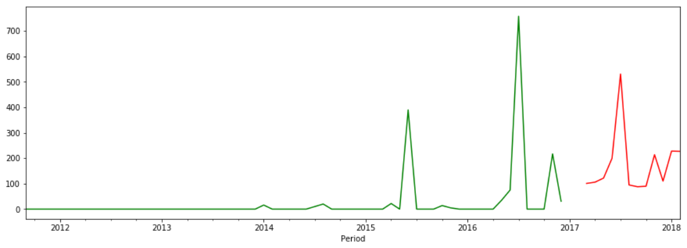

# Portfolio

---

### Product Demand Forecasting

This is my individual project in which I used a real-life dataset from [Kaggle](https://www.kaggle.com/felixzhao/productdemandforecasting) to do more practice on times series forecasting.

First, I analyzed to understand and clean the dataset, including investigating NA values, investigating negative demand values and removing negative values of returned products, removing products that do not meet criteria for statistical forecasting: stopped products and new products, etc.

Then I pre-processed the dataset to prepare for times series forecasting. I built four different models (ARIMA/SARIMA, Simple/Double/Triple Exponential Smoothing, Prophet) that are the most popular ones. I compared and extracted forecasts by models of lowest RMSE values for each product because different products have data patterns suitable for different models.

Later, I prepared another file to run the forecast automatically. The forecast user just needs to load data and choose the forecasting periods to generate forecasts and get the lists of products that are not qualified for statistical forecasting (stopped products and new products).

---

© 2020 Kim-Cuong Nguyen. Powered by Jekyll and the Minimal Theme.

