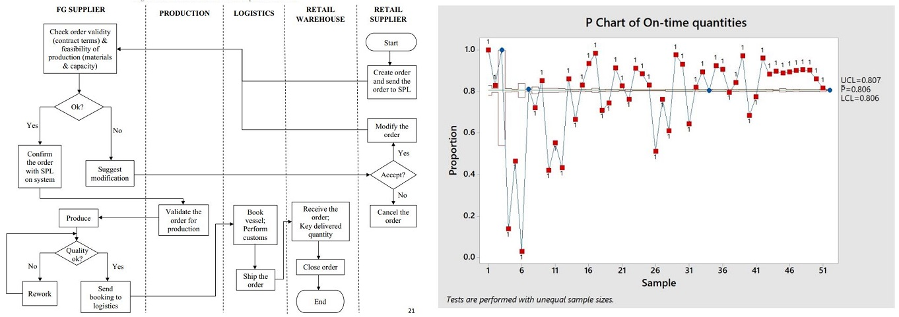

# Portfolio

---
## Product Demand Forecasting

A group project in fulfillment for the Consulting course, in which we worked on solving a real business case at a pharmaceutical client company.

In the project, we applied different NLP techniques on an oral care brand of the company.

The study serves two purposes:
- To extract customer insights related to overall brand perception and its product features that receive top attention from customers.
- To visualize customer perceptions about brands across the oral care sector to understand how Brand A is positioned against its competitors. 

These two objectives bring the team to the final goal of helping the company to understand how customers communicate about the brand and where perception or performance could be improved. 

 

---
## Product Demand Forecasting

My individual project in which I used a real-life dataset from [Kaggle](https://www.kaggle.com/felixzhao/productdemandforecasting) to do more practice on times series forecasting.

First, I analyzed and cleaned the dataset - investigating NA values, negative demand values, removing products that do not meet criteria for statistical forecasting: stopped products and new products, etc.  

I built four different models (ARIMA/SARIMA, Simple/Double/Triple Exponential Smoothing, Prophet). I compared and extracted forecasts by models of lowest RMSE values for each product because different products have data patterns suitable for different models. 

Later, I prepared another file to run the forecast automatically. The forecast user just needs to load data and choose the forecasting periods to generate forecasts and get the lists of products that are not qualified for statistical forecasting (stopped products and new products). 

 

---

## Weather Patterns and Forecast in Australia

My individual project in partial fulfillment of the course ***Data Mining for Business Analytics***, in which I learnt about Clustering, Association Analysis, a number of classification methods, and text mining.

I employed a weather dataset from Australia’s Bureau of Meteorology, comprised of 142,193 daily weather observations at 49 different
locations all over Australia between 2007 and 2017. 
  
First, I performed clustering analysis to find out locations across Australia that have similar weather conditions. 

Second, I built a predictive model to forecast the possibility of rain on the following day. I tried three techniques, including k
Nearest Neighbors, Support Vector Machine, and Artificial Neural Networks to get the one with best performance. I continued to use feature selection to improve the model performance. 

 

---

## Supply Chain Analytics Problems

Individual practices of using Python to solve supply chain problems. Most of the problems are self-created with reference to sample ones.

**Problems:**  

1. Supply Network Optimization  
 

 

---

## Screening for Chronic Kidney Disease (CKD)

A group project in fulfillment of the course ***Multivariate Analysis***, in which we learnt how to use four techniques, Principle Component Analysis, Factor Analysis, Logistics Regression, and Discriminant Analysis.

Objective: create an easy-to-use screening tool to identify people who run a high risk of CKD so that they can get treatment early - expect to earn $1,300 for a true positive and be penalized by $100 for a false positive.  
  
The team set two priorities for the screening tool.  
- Simplicity: The tool must be simple enough so that our grandparents could well understand to use as well.  
- Accuracy: This is a must. Otherwise, the tool does not make any sense.  
The team ran logistic regression on this dataset a few times to get the final predictive model on probabilities of CKD presence at patients. We first applied backward elimination approach to get the first model, from which we analyzed and defined significant variables that should be included in the screening tools. By narrowing down the number of variables to 9, we ran a reduced model and compared its performance to the first model – the backward elimination one.   

 

---

## NYC Collision Data Exploration

A group project in fulfillment of the course ***Predictive Business Analytics with Relational Database Data***, in which we learnt to use SAS for analytics purposes.

Objective: to find out undiscovered consequences or patterns behind the collision data other than common senses (e.g. High collision rate over a rush hour, downtown Manhattan, etc.). We would also give our suggestions and if possible, notify motorists, pedestrians on the road to be careful during certain times of the day and at certain locations.  
  
We employed 3 different datasets from the US Government open data website, data.gov. The time range which the datasets addresses is from 2012 – 2019. Each dataset is comprised of 3-4 million observations. We joined the datasets to answer 4 important problems. 

 

 

---

## Six Sigma Green Belt Project

Individual project in partial fulfillment for the course ***Six Sigma Green Belt for Managers*** at Texas Christian University, Neeley School of Business.

The project was conducted at a real company; however, in this report, company, department, and factory names have been replaced.  
  
This project, as required by Green Belt certification, aims at applying Six Sigma knowledge and tools to actual operations. In particular, I applied DMAIC process to improve order management process of a real company. During this project, I worked with project champion – a representative from the company to understand the most updated order management process at the company, and was provided with a dataset of 4,575 observations – 2018 replenishment orders. I made assessment using different tools and methods, and found two critical Xs that negatively affected on-time delivery and came up with several change concepts. Pros and cons of the solutions were evaluated with a decision matrix and two final solutions were proposed to modify the current order management process. 

 

 
---

© 2020 Kim-Cuong Nguyen. Powered by Jekyll and the Minimal Theme.

